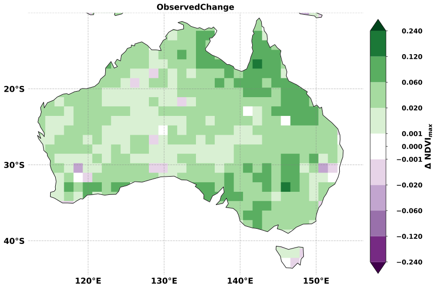
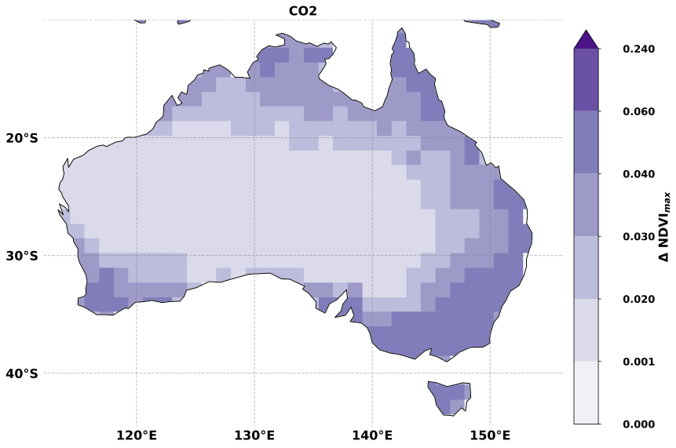
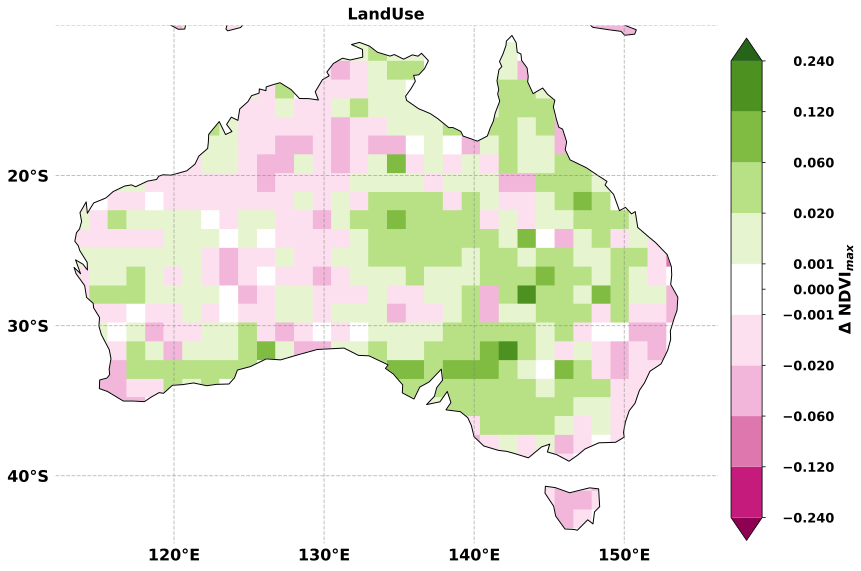
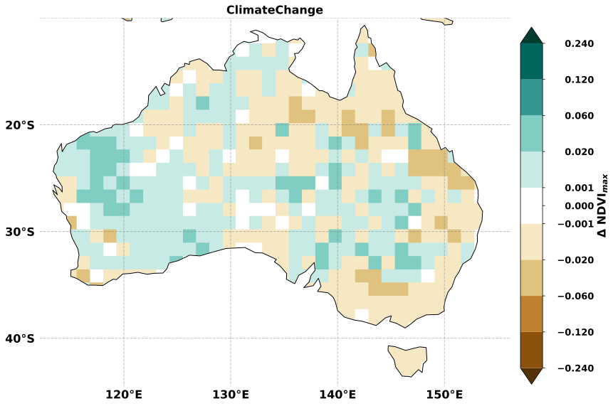
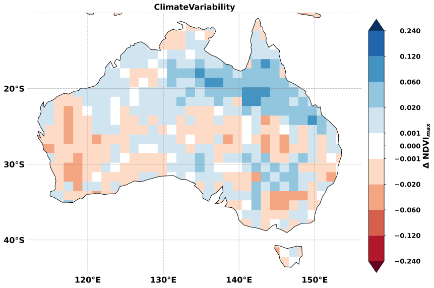
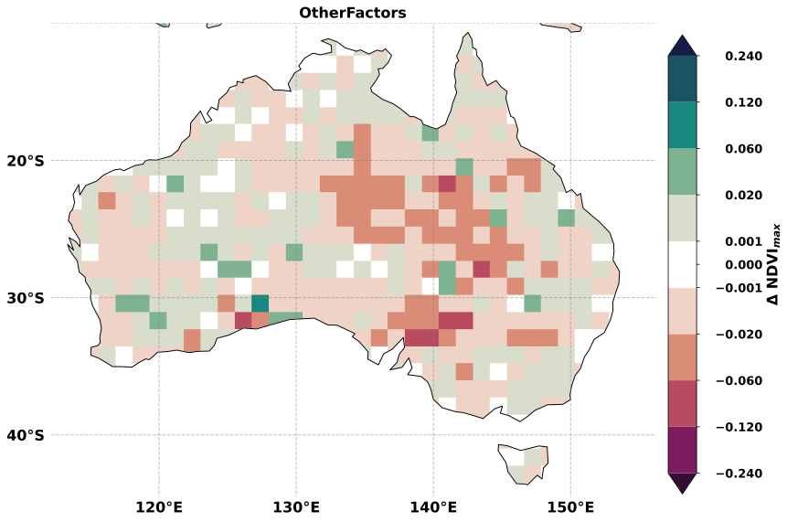
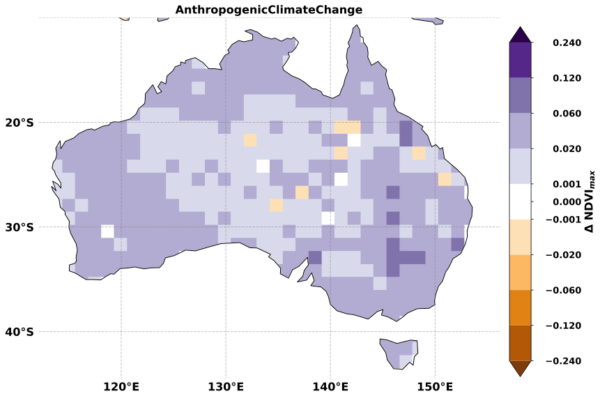

# Applying the TSS.RESTREND package to Netcdf spatial data


This folder gives and example of how TSS-RESTREND R package can be used to do analysis on netcdf format spatial data.  It uses a mix of python and R because that is the way I process data. The implementation here is not computationally efficient and massive performance gains can be achieved using pythons dask+xarray+scikit-learn to compute statistics on the entire dataset to calculate the observed change, the CO2, the climate change and climate variability components. THis folder contains the example code necessary to reproduce the results in Burrell et al. ([2020](https://doi.org/10.1038/s41467-020-17710-7))

This guide is broken up into 3 sections:

1. [Setup a programming environment](#l1)
2. [Performing a single TSS-RESTREND run](#l2)
3. [Performing multi-run ensemble statistics](#l3)

For demonstration purposes, we included four example netcdf files in the repository: GIMMS derived NDVI (1982-2015), TERRACLIMATE derived precipitation (1960-2015), TERRACLIMATE derived temperature (1960-2015), and SYNMAP C4 vegetation fraction. The example datasets should not be used for scientific analysis as they have been down-sampled to approximately 25km and had their spatial coverage limited to Australia to allow storage on github. You can find these example datasets in [data](data).

The example in this guide uses scripts located in [CustomFunctions](CustomFunctions) and it will not run if the folder is missing.  

<a name="l1">
</a>

## 1. Setting up a programming environment


#### Building a python environment using conda ####

The following are instructions on how to setup a conda python programming environment in any Ubuntu based Linux distribution including the Windows Subsystem for Linux (WSL).  Anaconda is available [here](https://www.anaconda.com/products/individual).  

```bash

#  Setting up Conda environment for the python parts of this code
conda config --add channels conda-forge
conda update -n base -c defaults conda

# Setup the new environment. These steps are optional but provent conflicts with existing python enviroments
conda create --name tssr
conda activate tssr

# install the relevant packages
conda install dask xarray pandas matplotlib palettable cartopy seaborn ipdb numba bottleneck netCDF4 webcolors gitpython geopandas shapely rasterio cdo python-cdo ipython statsmodels

# Install other usefull commmand line utils. This is optional, but makes it easy to read netcdf files
sudo apt-get intall ncview

# Sometimes, R packages can fail to install on Ubuntu because libcurl is missing. To fix this
sudo apt install libcurl4-openssl-dev

```

#### Building an R programming environment ####

The latest version of R is available from [CRAN](https://cran.r-project.org/mirrors.html). The TSS.RESTREND package was built with [Rstudio](https://rstudio.com/products/rstudio/download/).

```R
# ========== Install dependincies ==========
install.packages(c("bfast", "broom", "RcppRoll", "forecast", "car", "rgl", "ggplot2", "mblm", "curl", "rjson", "optparse", "foreach", "lubridate")) #"libcurl",

# ========== Install TSS.RESTREND from cran ==========
install.packages("TSS.RESTREND")

# ========== To use the parallel option in the code ==========
install.packages("doSNOW")
```
The other option is to use this repository to build TSS-RESTREND. Rstudio project file TSS.RESTREND.Rproj is located [here](../TSS.RESTREND/)
```R
# The following packages are needed to build TSS.RESTREND in Rstudio
install.packages(c("devtools", "roxygen2"))

```
To rebuild the package's documentation, it is also necessary to to install MikTeX from (https://miktex.org/).  

<a name="l2">
</a>

## 2. Performing a single TSS-RESTREND run 

To demonstrate how TSS-RESTREND can be applied to spatial data, this repository contains four scripts that need to be run in order, from S00 to S03, in order to: 1) set-up the analysis, 2) process the data, 3) perform TSS-RESTREND on the data, 4) reassemble the results into a netcdf file and save maps of the results.

The results are equivalent to a single run from Burrell et al., (2020). 

#### Setting up the meta data ####

The first script to run is [S00_SetupMetadata.py](./S00_SetupMetadata.py).  This saves a json file that is passed between all the following scripts with meta-data about the run. In this example, we use a coarsen value of 5 to speed up the analysis.  

```bash
# Run in console
python S00_SetupMetadata.py --coarsen 5
```

This script has six optional command line arguments:

 -  -h, --help;<space><space>show help message and exit

 -  -c, --coarsen (int);<space><space>size of the box used to downscale data. default=0. Passing a larger coarsen values will speed up analysis at the cost of resolution. The default of 0 means the analysis will occur at the 25km resolution of the demonstration datasets and will take many hours. Passing a value of 10 should downscales the data to 250km pixels which allow all the demonstration to run in less than 30 minutes.  

 -  -y, --yearly;<space><space>when calculating TSS-RESTREND, report values in change per year not Total Change. Default is Total Change

 -  --maxacp (int);<space><space>maximum accumulation period in months. default=12. See TSSRESTREND R package documentation. 

 -  --maxosp (int);<space><space>maximum offset period in months. default=4. See TSSRESTREND R package documentation. 

 -  --photo (str);<space><space>photosynthetic pathway used for calculating the CO2 effect size. Possible arguments: {"C3andC4","C3","C4"}. Default is "C3andC4" which uses the SYNMAP C4 vegetation fraction.  

 -  -a, --archive;<space><space>archive the existing `infomation.json` file in `./results/archive/.` instead of overwriting it. With some tweaks, this could be used to allow for multiple runs without overwriting results.  <a name="lz">
</a>


#### Reshape the example netcdf data into two-dimensional csv files ####


R can be very slow when working with higher dimensional rasters. Using python to convert the 3D netcdf files to a 2D `.csv` file, with latitude and longitudes as the row identifiers and timesteps as columns, reduces overall computation time. Which files are processed is determined using the `infomation.json` file produced in the previous step.

[S01_processingnetcdf.py](S01_processingnetcdf.py) opens the demonstration vegetation, precipitation, temperature and C4 fraction netcdf files then creates 2 dimensional `.csv` files that can be read in by R.

```bash
# Run in console
python S01_processingnetcdf.py
```
This script produces four csv files in the [data](./data/) folder: `demo_dataframe_ndvi.csv`, `demo_dataframe_ppt.csv`, `demo_dataframe_tmean.csv`, `demo_dataframe_C4frac.csv`.

The script has one optional argument:

- --use_archived (int);<space><space>rearchive the `infomation.json` files. The int corresponds to the number of the desired `./data/archive/infomation_{int}.json` file. 


#### Use R to perform TSS-RESTREND analysis ####


[S02_TSSRESTRENDattribution.R](./S02_TSSRESTRENDattribution.R) reads in the 2D csv files and uses the 'foreach' library to iterate over the data, performing TSS.RESTREND on each pixel and saving the results in `./results/AttributionResults.csv`.

This script uses a single core by default. However, looping through pixels is an 'embarrassingly parallel' problem and scales close to linearly with increases in cores. The script can be made to run in parallel by calling it with the `--ncores (int)` argument and `--ncores -1` will use all available cores.    

This script can be run in Rstudio or in the terminal using:
```bash
# Run in console single core
Rscript S02_TSSRESTRENDattribution.R

```
Or in parallel, e.g.:
```bash
Rscript S02_TSSRESTRENDattribution.R  --ncores -1

```

Note: The parallel portion of the script uses the 'doSNOW' package as a back-end and should work on most most computers. To run in an MPI cluster environment, modifying the arguments passed to the makecluster function will be required.  


#### Convert the results back to netcdf and make some maps ####

[S03_MappingResults.py](./S03_MappingResults.py) reads the `./results/AttributionResults.csv` file, converts it to a netcdf file adding all the appropriate history and meta-data, and saves it to `./results/TSSRattribution_Results.nc`. 

By default, this script will make maps of all the change variables and save them in the `./results/` folder. Example outputs of the script are also shown below.

```bash
python S03_MappingResults.py
```

    Starting write of data at: 2020-07-30 10:39:25.566447
    ObservedChange




    CO2
    





    LandUse
    





    ClimateChange
    





    ClimateVariability
    





    OtherFactors
    





    AnthropogenicClimateChange
    





This script does not apply any significance masking before making the plots, though it can be made to do so using the optional arguments:

- -h, --help;<space><space>show help message and exit

- -p, --Plots;<space><space>quiet plots: if selected, plots will not be displayed. Plots are on by default.

- -s, --sig;<space><space>significance: apply a zero mask using FDR adjustment. If true, values that don't meet field significance threshold of alpha=0.10 are masked in white.    

- --method;<space><space>method used to adjust for False Discovery Rate, must be "fdr_bh" or "fdr_by". The default is the Benjamini/Hochberg method ("fdr_bh"). See statsmodels [multitest](https://www.statsmodels.org/dev/generated/statsmodels.stats.multitest.multipletests.html) documentation for more details.

- --use_archived (int);<space><space>rearchive the `infomation.json` files. The int corresponds to the number of the desired `./data/archive/infomation_{int}.json` file. This functionality allows the use of files archived using [S00](#lx) 

<a name="l3">
</a>

## 3. Performing multi-run ensemble statistics

#### Determining statistical significance for multi-run ensembles ####

Burrell et al., [(2018)](https://doi.org/10.1016/j.isprsjprs.2018.08.017) showed that using multiple TSS-RESTREND runs using different dataset allows for the better quantification of errors.  Burrell et al., (2020) expanded on this by methods to address the issues of multiple testing and spatial autocorrelation.

For more details on these issues, see [Wilks 2016](https://doi.org/10.1175/BAMS-D-15-00267.1). A detailed ipython notebook describing the method and applying it to an included sample ensemble result can be found [here](EnsembleSignificance.ipynb).  

#### Combining matched C3/C4 runs ####

The TSS.RESTREND packages has been updated to make this feature unnecessary, but to see how it was done in Burrell et al., (2020), see the ipynb [here](CombineRuns.ipynb).  
